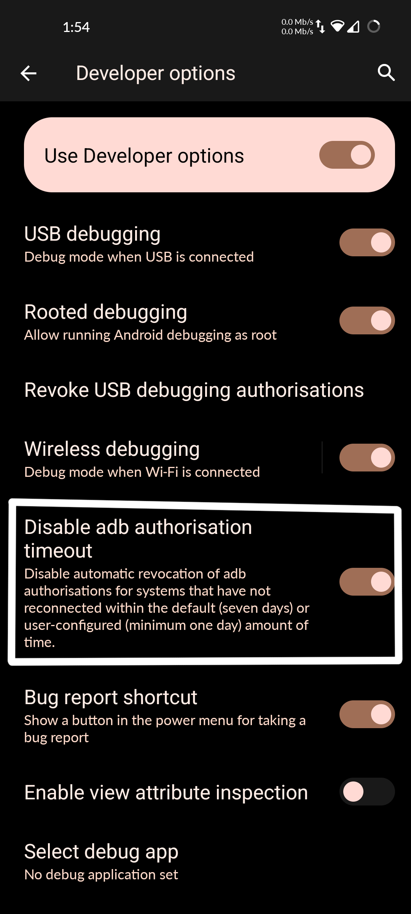

# Wireless-adb-autoconnect
Powershell script to automate wireless adb connection. It uses Nmap to find open ports for the wireless adb in the port range of 30000-60000.
---
## Requirements
1. [Nmap](https://nmap.org/download#windows)
2. Static IP address on your android devices
   - Go to Wifi Settings
   - Click on the **Gear icon** of your home network
     
       OR
   
     Tap and hold on the network > Click on modify.
   
   - Click on IP settings and select **Static**
   - Enter your IP address, Gateway, DNS 1 & 2.
   - Click on save.
---
## Steps
1. Enter your static device IP in the `adbw.ps1`
2. Use command `adb pair *Static IP*:port` 
   
   Then enter the pairing code to pair the deivce if you haven't already.
4. Place both the `.ps1` and `.bat` scripts to **System32** folder
#### You're Done!

### Make sure to enable this setting only on your home network!!

4. **Optional : Disable ADB authorisation timeout to make sure that your device doesn't need to do the pairing process on a regular basis.** 

---
### Usage
**Type `adbw` in either powershell or command prompt.**

